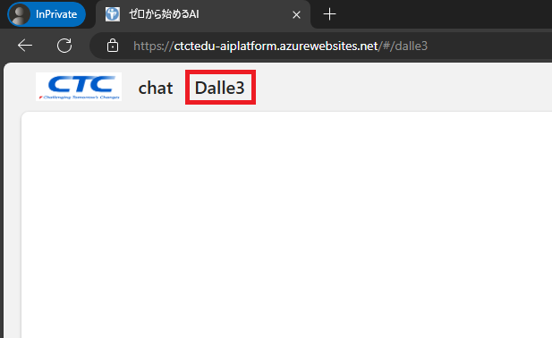

# ラボ 01：文章（プロンプト）を使用して画像を生成する

#### 推定時間: 20 分

## タスク1 - 演習環境へアクセスする

このタスクでは、生成AIラボへアクセスします。

1. 新しい InPrivate ブラウザー ウィンドウを開きます。

   > 　  どのWebブラウザもウィンドウ右上の設定ボタンから表示することが可能です。
   >
   > 　  Microsoft Edgeでは「InPrivate」ウィンドウ
   >
   > 　  Google Chromeでは「シークレット」ウィンドウ
   >
   > 　  Mozilla Fire Foxでは「プライベート」ウィンドウ

   

   

2. https://ctctedu-aiplatform.azurewebsites.net/ へアクセスし、以下のアカウントでサインインします。

   > 注：XXXは受講者ごとに異なります。
   >
   > 注：「アカウントの保護にご協力ください」と表示された場合は「今はしない」を選択してください

   | 項目       | 値                                  |
   | ---------- | ----------------------------------- |
   | ユーザーID | `aiuserXXX@ctctedu.onmicrosoft.com` |
   | パスワード | 講師から配布されたパスワード        |

   

   

3. [要求されているアクセス許可]が聞かれた場合は、 [承諾] をクリックします 。

   > 注：表示されない場合もあります。

   

   

4. [Start chatting] ページが表示されればサインイン完了となります。

   

   

## タスク2 - 簡単な指示で画像を生成する

このタスクでは、簡単な指示で、どのような画像が生成されるかを確認します。1単語の場合、複数の条件によって生成される画像の違いなどを確認します。

1. 画面左上の「Dalle3」をクリックします。

   　

   

   

2. 画面中央の入力フォームに「猫」を入力して「画像生成」をクリックします。

   > ※他の動物、物体、なんでも結構です。1単語だけ指定してください。
   >
   > 　例：「犬」「馬」「電車」「飛行機」「山」「川」など

3. 画像が生成されるのを待ちます。(30秒程度)

   

   

4. 「猫」に関連する画像が表示されたことを確認します。

   

   

5. さらに繰り返して、以下のキーワードをそれぞれ入力し「画像生成」をクリックします。

   - 公園で遊ぶ三毛猫
   - 魚を咥えたどら猫

   > ※そのほかにも「〇〇をする△△」などで、試してみて下さい。
   >
   > 　具体的な指示になるにつれ、生成されたイメージの精度が向上します。

## タスク3 - テーマ別に画像を生成する

このタスクでは、以下のいずれかのテーマに沿って、自分自身でプロンプトを考え、生成してみます。なお、この演習には正解はありません。

ご自身がイメージした内容や、自分が納得できるアイデアにたどり着くまで、プロンプトを工夫しながら試してみてください。

> ※あるいは、ご自身で好きにテーマを決めて、画像生成を行ってみてください。

- テーマ１　ブランドロゴのドラフト

  あなたの会社は、最先端の製造技術を駆使して高品質な製品を提供する製造業者です。この度、製造プロセスを劇的に効率化する「**スマート製造ロボットアーム**」シリーズを新たに立ち上げることになりました。この新しいプロダクトラインのブランドを象徴する素晴らしいロゴを作成する必要が生じました。しかし、アイデアがなかなか浮かびません。そこで生成AIを使い、ブランドロゴのイメージを固めてみます。

  

  

- テーマ２　デザインの創出

  老舗時計メーカー「タイムホリック」は、長い歴史と伝統を誇る一方で、常に革新を求める姿勢を持ち続けております。創業100年以上の歴史を持つこの会社は、数々の名作を世に送り出し、多くの時計愛好家から絶大な信頼を得てきました。しかし、時代は変わり、消費者のニーズも進化しています。この度、新たな挑戦として、近未来的な時計のデザインプロジェクトが立ち上がりました。目標は、伝統と革新を融合させ、未来のライフスタイルを象徴するアート作品を生み出すことです。あなたはデザイナーとして、生成AIを使い、デザインのイメージを膨らませます。
  
  
  
  

**Lab01 は以上です。お疲れ様でした。**
